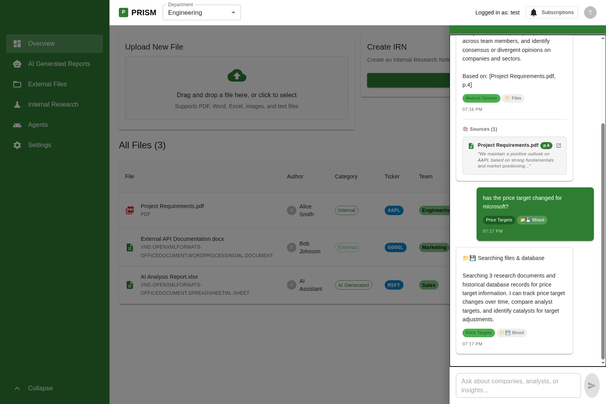

# Intent Detection & Citation System Requirements for PRISM Global Chat

## Overview
Implement an intelligent query routing system with intent detection and citation capabilities for the PRISM Global Chat feature. The system should automatically understand user queries, route them to appropriate data sources (Files, Database, Internet, or Mixed), and display source file references with page numbers and contextual snippets, similar to AlphaSense's Smart Summaries.

## Business Context
Investment research professionals need an intelligent assistant that:
- **Understands their intent** without requiring explicit commands or filters
- **Routes queries to the right data sources** (internal files, databases, external sources)
- **Provides transparency** by showing which documents informed the AI's answer
- **Enables verification** by linking to original source documents with page numbers
- **Tracks engagement** for analytics and continuous improvement

## System Architecture

```
User Query → Intent Detection → Data Source Routing → Query Execution → Response Generation → Citation Display
     ↓              ↓                    ↓                    ↓                  ↓                  ↓
"What are      analyst-opinion      📁 Files           Search internal    Generate response   Show sources
manisha's                                              research files     with inline         with page
view on IBM?"                                                             citations           numbers
```

## Functional Requirements

### 1. Intent Detection System (STEP 1)

#### 1.1 Purpose
Automatically categorize user queries into predefined intent categories to determine:
- What type of information the user is seeking
- Which data sources should be queried (Files, Database, Internet, Mixed)
- How to filter and rank results

#### 1.2 Intent Categories

The system should support 10 investment research intent categories:

| Intent Category | Description | Data Source | Example Queries |
|----------------|-------------|-------------|-----------------|
| **analyst-opinion** | Analyst views, opinions, perspectives on companies/sectors | 📁 Files | "What are manisha's view on IBM?", "Why does Sampath favor Apple?" |
| **management-meetings** | Management meeting notes, IRNs, executive interactions | 📁 Files | "What recent management meetings have taken place in Tech?", "Have we met Apple's CEO?" |
| **price-targets** | Price target changes, valuation updates | 📁💾 Mixed (Files + Database) | "Has the price target changed for Microsoft?", "What has been the price target for Apple over past two years?" |
| **financial-metrics** | Growth rates, margins, profitability metrics, financial data | 📁💾 Mixed (Files + Database) | "What is expected growth rate on revenues for XYZ?", "What companies have profit margin over 30%?" |
| **investment-decisions** | Investment thesis, buy/sell decisions, valuation concerns | 📁💾 Mixed (Files + Database) | "Companies we passed on buying because of valuation concerns?", "Has our thesis changed?" |
| **research-reports** | Sector reports, thematic research, company analysis | 📁 Files | "Latest research on tech sector?", "Show me recent sector reports" |
| **earnings-thesis** | Earnings impact on investment thesis, quarterly results | 📁 Files | "Has recent earnings changed our thesis on certain company?", "Q3 results impact on outlook?" |
| **thematic-analysis** | Cross-document themes, trends, summaries | 📁 Files | "Summarize key takeaways on natural gas in power generation", "Highlight how management focus evolved" |
| **company-sector** | General company/sector information, fundamentals | 📁💾 Mixed (Files + Database) | "Tell me about IBM", "Tech sector overview" |
| **historical-analysis** | Historical trends, time-series data, evolution over time | 📁💾 Mixed (Files + Database) | "Price target over past two years", "How has revenue growth trended?" |

#### 1.3 Data Source Routing

Based on the detected intent, route queries to appropriate data sources:

- **📁 Files**: Internal research notes, IRNs, analyst reports, meeting notes, PDFs
- **💾 Database**: Structured financial data, historical metrics, time-series data
- **📁💾 Mixed**: Queries requiring both files and database (e.g., price targets need both analyst reports and historical data)
- **🌐 Internet**: Real-time market data, news, external sources (future enhancement)

#### 1.4 Function: detectIntent(text: string): { intent: string; dataSource: string }

**Purpose**: Analyze user query text and return the detected intent category and appropriate data source.

**Input**: User query text (string)

**Output**: Object with `intent` (string) and `dataSource` ('files' | 'database' | 'mixed' | 'internet')

**Implementation Logic**:

Use regex pattern matching to identify intent based on keywords and phrases:

```typescript
const detectIntent = (text: string): { intent: string; dataSource: 'files' | 'database' | 'internet' | 'mixed' } => {
  const lowerText = text.toLowerCase();
  
  // 1. ANALYST OPINION - Look for opinion/view keywords + analyst/author references
  if (lowerText.match(/\b(view|opinion|favor|think|believe|perspective)\b.*\b(on|about)\b/i) ||
      lowerText.match(/\b(analyst|expert|researcher|author).*\b(view|opinion|favor|think)\b/i)) {
    return { intent: 'analyst-opinion', dataSource: 'files' };
  }
  
  // 2. MANAGEMENT MEETINGS - Look for meeting/executive keywords
  if (lowerText.match(/\b(management meeting|met|meeting with|ceo|cfo|management team|executive)\b/i) ||
      lowerText.match(/\b(management.*saying|management.*focus|key takeaway|meetings.*taken place|meetings.*have)\b/i)) {
    return { intent: 'management-meetings', dataSource: 'files' };
  }
  
  // 3. PRICE TARGETS - Look for price target keywords
  if (lowerText.match(/\b(price target|target price|pt changed|price objective)\b/i)) {
    return { intent: 'price-targets', dataSource: 'mixed' };
  }
  
  // 4. FINANCIAL METRICS - Look for financial metric keywords
  if (lowerText.match(/\b(growth rate|profit margin|revenue|earnings|ebitda|operating margin|roe|roic)\b/i) ||
      lowerText.match(/\b(margin over|companies.*operating with)\b/i)) {
    return { intent: 'financial-metrics', dataSource: 'mixed' };
  }
  
  // 5. INVESTMENT DECISIONS - Look for investment decision keywords
  if (lowerText.match(/\b(passed on|valuation concern|investment decision|buy|sell|hold decision)\b/i) ||
      lowerText.match(/\b(thesis.*change|change.*thesis)\b/i)) {
    return { intent: 'investment-decisions', dataSource: 'mixed' };
  }
  
  // 6. RESEARCH REPORTS - Look for research/report keywords
  if (lowerText.match(/\b(latest research|recent research|research on|research report|sector report)\b/i)) {
    return { intent: 'research-reports', dataSource: 'files' };
  }
  
  // 7. EARNINGS & THESIS - Look for earnings + thesis keywords
  if (lowerText.match(/\b(earnings|quarterly result|q[1-4] result).*\b(thesis|view|outlook)\b/i)) {
    return { intent: 'earnings-thesis', dataSource: 'files' };
  }
  
  // 8. THEMATIC ANALYSIS - Look for summarization/theme keywords
  if (lowerText.match(/\b(summarize|highlight|key takeaway|theme|trend across)\b/i)) {
    return { intent: 'thematic-analysis', dataSource: 'files' };
  }
  
  // 9. COMPANY/SECTOR - Look for company/sector keywords
  if (lowerText.match(/\b(company|stock|ticker|corporation|firm|equity|sector|industry)\b/i)) {
    return { intent: 'company-sector', dataSource: 'mixed' };
  }
  
  // 10. HISTORICAL ANALYSIS - Look for time-based keywords
  if (lowerText.match(/\b(over past|last|historical|trend|evolution|over time)\b/i)) {
    return { intent: 'historical-analysis', dataSource: 'mixed' };
  }
  
  // DEFAULT - General query
  return { intent: 'general', dataSource: 'files' };
};
```

**Testing Examples**:

| Query | Expected Intent | Expected Data Source | Reasoning |
|-------|----------------|---------------------|-----------|
| "what are manisha's view on IBM?" | analyst-opinion | files | Contains "view" + author name |
| "Why does Sampath favor Apple" | analyst-opinion | files | Contains "favor" (opinion keyword) + author name |
| "Latest research on tech sector?" | research-reports | files | Contains "latest research" |
| "what recent management meetings have taken place in Tech" | management-meetings | files | Contains "management meetings" + "taken place" |
| "has the price target changed for microsoft?" | price-targets | mixed | Contains "price target" |
| "what has been the price target for apple over past two years" | historical-analysis | mixed | Contains "over past" (time-based) |
| "Have we met apples ceo?" | management-meetings | files | Contains "met" + "ceo" |
| "what is expected growth rate on revenues and earnings for XYZ company over next 3 years?" | financial-metrics | mixed | Contains "growth rate" + "revenues" + "earnings" |
| "what companies have been operating with profit margin over 30%" | financial-metrics | mixed | Contains "profit margin" |
| "Has there been any recent earnings to change our thesis on certain company?" | earnings-thesis | files | Contains "earnings" + "thesis" |
| "what are management teams saying abt the state of the economy and consumer?" | management-meetings | files | Contains "management" + "saying" |
| "are there any companies we looked at Prism and we passed on buying because of valuation concerns" | investment-decisions | mixed | Contains "passed on" + "valuation concern" |
| "Highlight how key focuses of management meetings with this company have evolved over last few meetings?" | thematic-analysis | files | Contains "highlight" + "evolved" |
| "Summarize the key takeaways on the importance of natural gas in power generation from data centers in management meetings and sell side notes?" | thematic-analysis | files | Contains "summarize" + "key takeaways" |

#### 1.5 UI Display of Intent & Data Source

Display the detected intent and data source as chips on each message:

**Intent Chip**:
- Label: Intent name with spaces (e.g., "analyst opinion", "price targets")
- Size: small
- Height: 22px
- Font size: 0.7rem
- Text transform: capitalize
- Background: primary.light (for assistant), primary.dark (for user)
- Color: primary.dark (for assistant), white (for user)

**Data Source Chip**:
- Label: Icon + text (e.g., "📁 Files", "💾 Database", "📁💾 Mixed", "🌐 Web")
- Size: small
- Height: 22px
- Font size: 0.7rem
- Background: grey.200 (for assistant), rgba(255,255,255,0.2) (for user)
- Color: text.secondary (for assistant), white (for user)

#### 1.6 Visual Examples

**Screenshot: Complete System in Action**



This screenshot demonstrates the complete intent detection and citation system:

1. **First Query**: "what are manisha's view on IBM?"
   - ✅ Intent detected: "analyst opinion" (shown as chip)
   - ✅ Data source: "📁 Files" (shown as chip)
   - ✅ Response includes inline citation: "Based on: [Project Requirements.pdf, p.4]"
   - ✅ Sources section displays citation card with:
     - Document icon (📄)
     - File name: "Project Requirements.pdf"
     - Page chip: "p.4" (blue badge)
     - Open icon (🔗)
     - Snippet: "We maintain a positive outlook on AAPL based on strong fundamentals..."

2. **Second Query**: "has the price target changed for microsoft?"
   - ✅ Intent detected: "price targets" (shown as chip)
   - ✅ Data source: "📁💾 Mixed" (Files + Database, shown as chip)
   - ✅ Response shows appropriate data source routing
   - ℹ️ No citations shown (no matching files with price/target keywords - expected behavior)

**Key UI Elements Visible**:
- Intent chips with capitalized text (e.g., "analyst opinion", "price targets")
- Data source chips with icons (📁 Files, 📁💾 Mixed)
- Inline citations in response text
- Expandable Sources section with citation cards
- Hover-ready citation cards with border and shadow
- Clean, professional investment research aesthetic

#### 1.7 Intent Detection Flow Diagram

```
┌─────────────────────────────────────────────────────────────────────┐
│                         USER QUERY                                   │
│              "what are manisha's view on IBM?"                       │
└────────────────────────────┬────────────────────────────────────────┘
                             │
                             ▼
┌─────────────────────────────────────────────────────────────────────┐
│                    INTENT DETECTION                                  │
│  Regex Pattern Matching:                                             │
│  - Check for "view" keyword ✓                                        │
│  - Check for author name "manisha" ✓                                 │
│  - Match: analyst-opinion pattern                                    │
└────────────────────────────┬────────────────────────────────────────┘
                             │
                             ▼
┌─────────────────────────────────────────────────────────────────────┐
│                  DATA SOURCE ROUTING                                 │
│  Intent: analyst-opinion                                             │
│  → Route to: 📁 Files (internal research notes)                      │
└────────────────────────────┬────────────────────────────────────────┘
                             │
                             ▼
┌─────────────────────────────────────────────────────────────────────┐
│                  CITATION GENERATION                                 │
│  Filter files by:                                                    │
│  - Author name: "manisha" ✓                                          │
│  - Ticker: "IBM" ✓                                                   │
│  - Category: internal ✓                                              │
│  → Found: Project Requirements.pdf                                   │
└────────────────────────────┬────────────────────────────────────────┘
                             │
                             ▼
┌─────────────────────────────────────────────────────────────────────┐
│                  RESPONSE GENERATION                                 │
│  Generate response with:                                             │
│  - Data source indicator: "📁 Searching files"                       │
│  - Contextual explanation                                            │
│  - Inline citation: "Based on: [Project Requirements.pdf, p.4]"     │
└────────────────────────────┬────────────────────────────────────────┘
                             │
                             ▼
┌─────────────────────────────────────────────────────────────────────┐
│                      UI DISPLAY                                      │
│  Message with:                                                       │
│  - Intent chip: "analyst opinion"                                    │
│  - Data source chip: "📁 Files"                                      │
│  - Response text with inline citation                                │
│  - Sources section with citation card                                │
└─────────────────────────────────────────────────────────────────────┘
```

#### 1.8 Citation Card Anatomy

```
┌────────────────────────────────────────────────────────────────────┐
│  📄  Project Requirements.pdf    [p.4]                          🔗  │
│      "We maintain a positive outlook on AAPL based on strong       │
│      fundamentals and market positioning..."                       │
└────────────────────────────────────────────────────────────────────┘
 │    │                              │                             │
 │    │                              │                             │
 │    └─ File Name                   └─ Page Number Chip          └─ Open Icon
 │       (caption, bold)                (blue badge)                  (clickable)
 │
 └─ Document Icon
    (primary color)

Hover State:
- Background changes to action.selected
- Border changes to primary.main
- Card slides 4px to the right
- Cursor becomes pointer
```

### 2. Data Model

#### 2.1 Citation Interface
Create a TypeScript interface for citations:

```typescript
interface Citation {
  fileName: string;      // Name of the source file
  page: number;          // Page number within the file
  snippet: string;       // Contextual text excerpt from the page
  fileId: string;        // Unique identifier to locate/open the file
}
```

#### 2.2 Message Interface Extension
Extend the existing Message interface to include citations:

```typescript
interface Message {
  id: string;
  text: string;
  sender: 'user' | 'assistant';
  timestamp: Date;
  intent?: string;
  dataSource?: 'files' | 'database' | 'internet' | 'mixed';
  citations?: Citation[];  // NEW: Array of citations for this message
}
```

### 3. Citation Generation Logic (STEP 2)

#### 3.1 Function: generateCitations(intent: string, userMessage: string): Citation[]

**Purpose**: Generate relevant citations based on the user's query and detected intent.

**Inputs**:
- `intent`: The detected intent category (e.g., 'analyst-opinion', 'price-targets', 'management-meetings')
- `userMessage`: The user's original query text

**Logic**:
1. **Filter Relevant Files**: Search through available files and filter based on:
   - **Ticker Match**: If the query mentions a company ticker (e.g., "IBM", "AAPL"), include files with matching `ticker` field
   - **Author Match**: If the query mentions an author name (e.g., "manisha's view"), include files by that author
   - **Intent-Based Filtering**:
     - `analyst-opinion` → Internal research files (`category === 'internal'`)
     - `management-meetings` → Files with "meeting" or "irn" in filename
     - `research-reports` → Internal or external research files
     - `price-targets` → Files with "price", "target", or "valuation" in filename
     - Other intents → Apply similar keyword/category matching

2. **Select Top Citations**: Limit to 3-4 most relevant files (to avoid overwhelming the user)

3. **Generate Page Numbers**: 
   - **Current Implementation**: Random page numbers (1-20) for demo purposes
   - **Production Requirement**: Parse actual file content to find relevant page numbers where the information appears

4. **Generate Snippets**: Create contextual text excerpts
   - **Current Implementation**: Template-based snippets matching the intent type
   - **Production Requirement**: Extract actual text from the relevant page using:
     - PDF parsing libraries (e.g., pdf-parse, pdfjs-dist)
     - Text search to find sentences containing query keywords
     - Truncate to ~150 characters with ellipsis

**Output**: Array of Citation objects (0-4 citations)

**Example**:
```typescript
// Query: "what are manisha's view on IBM?"
// Intent: "analyst-opinion"
// Returns:
[
  {
    fileName: "IBM Analysis Q4 2024.pdf",
    page: 5,
    snippet: "We maintain a positive outlook on IBM based on strong fundamentals and market positioning...",
    fileId: "file-123"
  },
  {
    fileName: "Tech Sector Overview.pdf",
    page: 12,
    snippet: "IBM's cloud revenue growth accelerated to 15% YoY, exceeding our expectations...",
    fileId: "file-456"
  }
]
```

### 4. Response Text Integration (STEP 3)

#### 4.1 Inline Citations in Response
Modify the `generateResponse` function to include inline citations at the end of the response text:

**Format**: `\n\nBased on: [File1.pdf, p.5], [File2.pdf, p.12]`

**Example**:
```
📁 Searching files

Searching through 3 internal research notes and 2 external reports to find analyst opinions. I can surface specific analyst views, compare perspectives across team members, and identify consensus or divergent opinions on companies and sectors.

Based on: [IBM Analysis Q4 2024.pdf, p.5], [Tech Sector Overview.pdf, p.12]
```

**Implementation**:
```typescript
const generateResponse = (userMessage: string, intent: string, dataSource: string, citations: Citation[]): string => {
  // ... existing response generation logic ...
  
  const citationText = citations.length > 0 
    ? `\n\nBased on: ${citations.map((c) => `[${c.fileName}, p.${c.page}]`).join(', ')}`
    : '';
  
  return `${mainResponseText}${citationText}`;
};
```

### 5. UI Components (STEP 4)

#### 5.1 Sources Section
Display citations below the assistant message in a dedicated "Sources" section.

**Visual Design**:
- Section header: "📚 Sources (N)" where N is the citation count
- Divider line above the section (1px solid, divider color)
- Vertical stack of citation cards with 8px gap between cards

#### 5.2 Citation Card Component
Each citation should be displayed as an interactive card with:

**Layout**:
```
┌─────────────────────────────────────────────┐
│ 📄  [File Name]  [p.5]  🔗                  │
│     "Snippet text goes here..."             │
└─────────────────────────────────────────────┐
```

**Elements**:
1. **Document Icon** (📄 / Description icon from MUI)
   - Size: 18px
   - Color: primary.main
   - Position: Left side, top-aligned

2. **File Name** (Typography)
   - Variant: caption
   - Font weight: 600
   - Color: text.primary

3. **Page Number Chip** (MUI Chip)
   - Label: "p.{pageNumber}"
   - Size: small
   - Height: 18px
   - Font size: 0.65rem
   - Background: primary.main
   - Color: white
   - Font weight: 600

4. **Open Icon** (🔗 / OpenInNew icon from MUI)
   - Size: 14px
   - Color: text.secondary
   - Position: Right side (ml: auto)

5. **Snippet Text** (Typography)
   - Variant: caption
   - Font size: 0.7rem
   - Color: text.secondary
   - Font style: italic
   - Line height: 1.4
   - Display: block (below the file name row)

**Styling**:
- Background: action.hover
- Padding: 12px (1.5 spacing units)
- Border: 1px solid divider
- Border radius: 12px (1.5 spacing units)
- Cursor: pointer
- Transition: all 0.2s

**Hover State**:
- Background: action.selected
- Border color: primary.main
- Transform: translateX(4px) (slight slide to the right)

#### 5.3 Complete JSX Structure
```tsx
{message.citations && message.citations.length > 0 && (
  <Box sx={{ mt: 2, pt: 2, borderTop: '1px solid', borderColor: 'divider' }}>
    <Typography variant="caption" sx={{ fontWeight: 600, color: 'text.secondary', display: 'block', mb: 1 }}>
      📚 Sources ({message.citations.length})
    </Typography>
    <Box sx={{ display: 'flex', flexDirection: 'column', gap: 1 }}>
      {message.citations.map((citation, idx) => (
        <Paper
          key={idx}
          elevation={0}
          sx={{
            p: 1.5,
            bgcolor: 'action.hover',
            cursor: 'pointer',
            transition: 'all 0.2s',
            border: '1px solid',
            borderColor: 'divider',
            borderRadius: 1.5,
            '&:hover': {
              bgcolor: 'action.selected',
              borderColor: 'primary.main',
              transform: 'translateX(4px)',
            },
          }}
          onClick={() => handleCitationClick(citation)}
        >
          <Box sx={{ display: 'flex', alignItems: 'flex-start', gap: 1 }}>
            <Description sx={{ fontSize: 18, color: 'primary.main', mt: 0.2 }} />
            <Box sx={{ flex: 1 }}>
              <Box sx={{ display: 'flex', alignItems: 'center', gap: 0.5, mb: 0.5 }}>
                <Typography variant="caption" sx={{ fontWeight: 600, color: 'text.primary' }}>
                  {citation.fileName}
                </Typography>
                <Chip
                  label={`p.${citation.page}`}
                  size="small"
                  sx={{
                    height: 18,
                    fontSize: '0.65rem',
                    bgcolor: 'primary.main',
                    color: 'white',
                    fontWeight: 600,
                  }}
                />
                <OpenInNew sx={{ fontSize: 14, color: 'text.secondary', ml: 'auto' }} />
              </Box>
              <Typography variant="caption" sx={{ color: 'text.secondary', fontSize: '0.7rem', fontStyle: 'italic', display: 'block', lineHeight: 1.4 }}>
                {citation.snippet}
              </Typography>
            </Box>
          </Box>
        </Paper>
      ))}
    </Box>
  </Box>
)}
```

### 6. User Interactions

#### 6.1 Citation Click Handler
Implement a click handler that:
1. Logs analytics event with citation details
2. Opens the source file at the specified page

```typescript
const handleCitationClick = (citation: Citation) => {
  // Log analytics
  logAnalytics('citation_clicked', { 
    fileName: citation.fileName, 
    page: citation.page,
    fileId: citation.fileId 
  });
  
  // Navigate to file (implementation depends on your file viewer)
  // Option 1: Open in new tab/window
  // Option 2: Navigate to file detail page with page parameter
  // Option 3: Open inline PDF viewer at specific page
  
  console.log(`Opening file: ${citation.fileName} at page ${citation.page}`);
  // TODO: Implement actual file navigation
};
```

### 7. Integration Points

#### 7.1 Message Send Flow
Update the `handleSendMessage` function to generate and attach citations:

```typescript
const handleSendMessage = () => {
  if (!inputValue.trim()) return;

  const { intent, dataSource } = detectIntent(inputValue);
  const citations = generateCitations(intent, inputValue);  // NEW

  const userMessage: Message = {
    id: Date.now().toString(),
    text: inputValue,
    sender: 'user',
    timestamp: new Date(),
    intent,
    dataSource,
  };

  setMessages(prev => [...prev, userMessage]);
  logAnalytics('message_sent', { 
    text: inputValue, 
    intent, 
    dataSource,
    citationCount: citations.length  // NEW
  });

  setInputValue('');

  setTimeout(() => {
    const assistantMessage: Message = {
      id: (Date.now() + 1).toString(),
      text: generateResponse(inputValue, intent, dataSource, citations),  // UPDATED
      sender: 'assistant',
      timestamp: new Date(),
      intent,
      dataSource,
      citations,  // NEW
    };
    setMessages(prev => [...prev, assistantMessage]);
  }, 500);
};
```

#### 7.2 Required Imports
Add these Material-UI icons to your imports:

```typescript
import {
  Chat,
  Close,
  Send,
  SmartToy,
  Description,    // NEW: For document icon
  OpenInNew,      // NEW: For open/link icon
} from '@mui/icons-material';
```

### 7. Analytics Events

Track the following events for product analytics:

| Event | Trigger | Data Payload |
|-------|---------|--------------|
| `message_sent` | User sends a message | `{ text, intent, dataSource, citationCount }` |
| `citation_clicked` | User clicks a citation card | `{ fileName, page, fileId }` |

### 8. Edge Cases & Behavior

#### 8.1 No Citations Found
- If `generateCitations` returns an empty array, do NOT display the Sources section
- The inline citation text should also be omitted from the response
- This is expected behavior when no relevant files match the query

#### 8.2 Multiple Citations
- Display up to 4 citations per response
- Order by relevance (most relevant first)
- If more than 4 relevant files exist, select the top 4

#### 8.3 Citation Visibility
- Citations should only appear on assistant messages, never on user messages
- Citations are part of the message state and persist in the conversation history

### 9. Testing Requirements

#### 9.1 Manual Testing Scenarios
Test with these sample queries to verify intent detection and citation generation:

| Query | Expected Intent | Expected Data Source | Expected Citations |
|-------|----------------|---------------------|-------------------|
| "what are manisha's view on IBM?" | analyst-opinion | Files | Files by author "Manisha" or with ticker "IBM" |
| "has the price target changed for microsoft?" | price-targets | Mixed | Files with "price"/"target" in name or ticker "MSFT" |
| "what recent management meetings have taken place in Tech?" | management-meetings | Files | Files with "meeting"/"irn" in name |
| "Latest research on tech sector?" | research-reports | Files | Internal/external research files |

#### 9.2 UI Testing
- [ ] Citations display correctly below assistant messages
- [ ] Citation cards have proper hover effects (background change, border color, slide animation)
- [ ] Page number chips are styled correctly (blue background, white text)
- [ ] Snippets are italicized and properly truncated
- [ ] Clicking a citation logs the analytics event to console
- [ ] Sources section only appears when citations exist

#### 9.3 Responsive Testing
- [ ] Citation cards stack vertically on mobile
- [ ] Text wraps properly in citation cards
- [ ] Icons scale appropriately on different screen sizes

### 10. Future Enhancements (Out of Scope for Initial Implementation)

#### 10.1 Real File Parsing
- Integrate PDF parsing library (pdf-parse, pdfjs-dist)
- Extract actual text from pages
- Use NLP to find most relevant sentences
- Generate accurate page numbers based on content location

#### 10.2 File Navigation
- Implement actual file opening functionality
- Support deep linking to specific pages in PDF viewer
- Highlight relevant text on the page

#### 10.3 Citation Ranking
- Implement relevance scoring algorithm
- Consider recency, author authority, document type
- Allow users to sort citations by relevance/date

#### 10.4 Citation Persistence
- Store citations in backend database
- Enable citation history across sessions
- Support citation export/sharing

## Technical Notes

### Dependencies
- Material-UI (MUI) v5+ for UI components
- React 18+ with TypeScript
- Existing FileItem interface from `src/types/index.ts`

### File Locations
- Citation logic: `src/components/GlobalChat.tsx`
- Type definitions: `src/types/index.ts` (if separating Citation interface)
- Analytics: Console logging (replace with actual analytics service)

### Performance Considerations
- Citation generation should complete in <100ms
- Limit file filtering to avoid blocking UI
- Consider memoizing citation results for repeated queries

## Acceptance Criteria

✅ Citations appear below assistant messages with file name, page number, and snippet
✅ Citation cards are clickable and log analytics events
✅ Inline citations appear in response text when citations exist
✅ Sources section only displays when citations are available
✅ Hover effects work correctly on citation cards
✅ All 10 sample queries generate appropriate citations
✅ No TypeScript errors or console warnings
✅ UI matches the design specifications (spacing, colors, typography)

## Reference Implementation
See PR #12 in manishagupta81/devin-test for complete working implementation.
