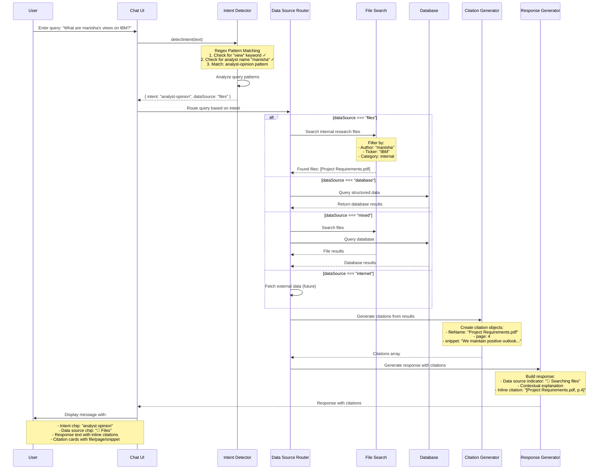

# PRISM Investment Research Platform

A comprehensive investment research platform with AI-powered global chat, intent detection, and citation system.

## Features
- React 19.1.0 with TypeScript
- Material-UI components
- Document management system interface
- **Global Chat with Intent Detection** - AI assistant for investment research queries
- **Smart Query Suggestions** - Dynamic prompts based on selected company
- **Citation System** - Source file references with page numbers (AlphaSense-inspired)
- **Data Source Routing** - Automatic routing to Files, Database, Mixed, or Internet

## Global Chat Architecture

### Intent Detection & Data Source Routing

The Global Chat feature uses an intelligent intent detection system to automatically categorize user queries and route them to appropriate data sources. Below is the sequence diagram showing the complete flow:

### Intent Categories & Data Source Mapping

| Intent Category | Description | Data Source | Example Queries |
|----------------|-------------|-------------|-----------------|
| **analyst-opinion** | Analyst views, opinions, perspectives | 📁 Files | "What are manisha's views on IBM?" |
| **management-meetings** | Management meeting notes, IRNs | 📁 Files | "Recent management meetings in Tech?" |
| **price-targets** | Price target changes, valuations | 📁💾 Mixed | "Has price target changed for MSFT?" |
| **financial-metrics** | Growth rates, margins, profitability | 📁💾 Mixed | "Expected growth rate for XYZ?" |
| **investment-decisions** | Investment thesis, buy/sell decisions | 📁💾 Mixed | "Companies we passed on buying?" |
| **research-reports** | Sector reports, thematic research | 📁 Files | "Latest research on tech sector?" |
| **earnings-thesis** | Earnings impact on thesis | 📁 Files | "Has earnings changed our thesis?" |
| **thematic-analysis** | Cross-document themes, trends | 📁 Files | "Summarize key takeaways on natural gas" |
| **company-sector** | General company/sector information | 📁💾 Mixed | "Tell me about IBM" |
| **historical-analysis** | Historical trends, time-series data | 📁💾 Mixed | "Price target over past two years" |

### Key Components

1. **Intent Detector** (`detectIntent` function)
   - Uses regex pattern matching to identify query intent
   - Analyzes keywords, phrases, and context
   - Returns intent category and appropriate data source

2. **Data Source Router**
   - Routes queries based on detected intent
   - Supports 4 data sources:
     - 📁 **Files**: Internal research notes, IRNs, analyst reports
     - 💾 **Database**: Structured financial data, historical metrics
     - 📁💾 **Mixed**: Queries requiring both files and database
     - 🌐 **Internet**: Real-time market data (future enhancement)

3. **Citation Generator** (`generateCitations` function)
   - Filters files based on query context (ticker, author, keywords)
   - Generates citation objects with file name, page number, and snippet
   - Supports up to 4 most relevant citations per response

4. **Response Generator** (`generateResponse` function)
   - Creates contextual responses based on intent and data source
   - Includes inline citations in response text
   - Adds data source indicators (e.g., "📁 Searching files...")

### Smart Query Suggestions

The chat includes 5 dynamic query suggestions that update based on selected ticker:

1. **Analyst Views** - Get analyst opinions and sentiment
2. **Price Targets** - Track price target changes over time
3. **Management Meetings** - View meeting notes and summaries
4. **Financial Performance** - Analyze financial metrics and performance
5. **Research Reports** - Access latest research and analysis

Each suggestion includes:
- Category title with icon
- Ticker-specific question text
- **Use** button (populates input field)
- **Copy** button (copies to clipboard)

### Analytics & Logging

All user interactions are logged for analytics:
- `chat_opened` - User opens chat drawer
- `chat_closed` - User closes chat drawer
- `message_sent` - User sends a message (includes intent and dataSource)
- `starter_selected` - User clicks "Use" on conversation starter
- `starter_copied` - User clicks "Copy" on conversation starter
- `citation_clicked` - User clicks on citation card

## Documentation

See `CITATION_REQUIREMENTS.md` for complete technical specifications including:
- Data models (TypeScript interfaces)
- Intent detection logic (regex patterns)
- Citation generation algorithm
- UI component specifications
- Testing scenarios and acceptance criteria
- Future enhancements (real PDF parsing, file navigation, ML-based intent detection)
